  

  

##  Terminal: stack --show

  <h3>💻 Backend & Frameworks</h3>
  
  
  
  
  
  
  <h3>🌐 Frontend & Mobile</h3>
  
  
  
  
  
  
  <h3>🛢️ Databases</h3>
  
  
  
  
  
  
  
  <h3>🐧 DevOps & OS</h3>
  
  
  
  
  

##  GitHub Stats

  <picture>
    <source 
      srcset="https://github-readme-stats.vercel.app/api?username=FreddyMachaca&show_icons=true&theme=radical&bg_color=00000000&text_color=00FF00&icon_color=FD428E&title_color=00FF00&hide_border=true"
      media="(prefers-color-scheme: dark)"
    />
    <source
      srcset="https://github-readme-stats.vercel.app/api?username=FreddyMachaca&show_icons=true&theme=default"
      media="(prefers-color-scheme: light), (prefers-color-scheme: no-preference)"
    />
    
  </picture>
  <picture>
    <source 
      srcset="https://github-readme-stats.vercel.app/api/top-langs/?username=FreddyMachaca&layout=compact&theme=radical&bg_color=00000000&text_color=00FF00&icon_color=FD428E&title_color=00FF00&hide_border=true"
      media="(prefers-color-scheme: dark)"
    />
    <source
      srcset="https://github-readme-stats.vercel.app/api/top-langs/?username=FreddyMachaca&layout=compact&theme=default"
      media="(prefers-color-scheme: light), (prefers-color-scheme: no-preference)"
    />
    
  </picture>

  <picture>
    <source 
      srcset="https://github-readme-streak-stats.herokuapp.com/?user=FreddyMachaca&theme=radical&background=00000000&ring=00FF00&fire=FD428E&currStreakNum=00FF00&sideNums=00FF00&currStreakLabel=00FF00&sideLabels=00FF00&dates=A9FEF7&hide_border=true"
      media="(prefers-color-scheme: dark)"
    />
    <source
      srcset="https://github-readme-streak-stats.herokuapp.com/?user=FreddyMachaca&theme=default"
      media="(prefers-color-scheme: light), (prefers-color-scheme: no-preference)"
    />
    
  </picture>

